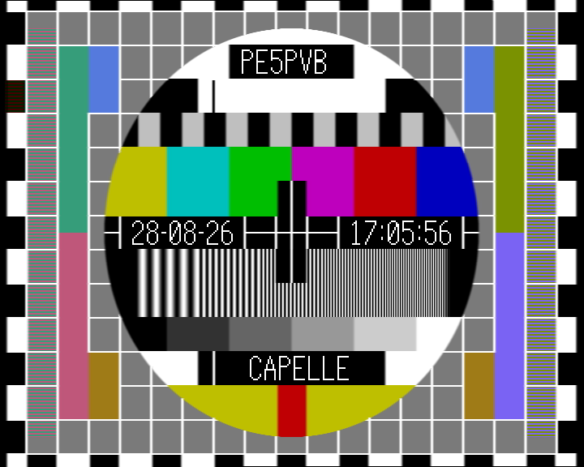
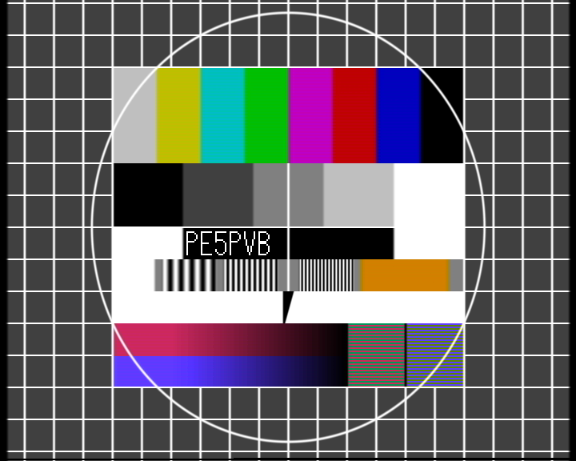
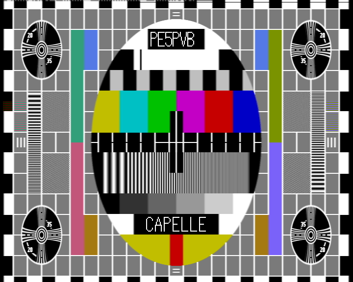
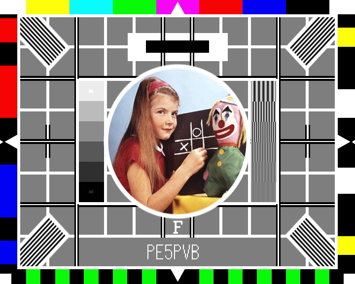
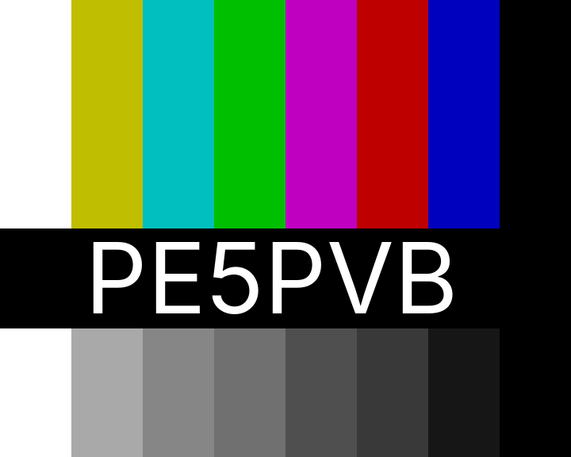
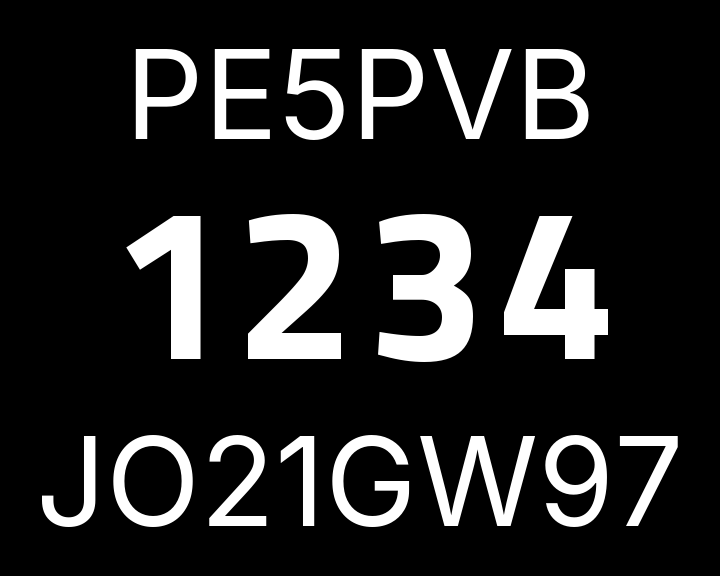

[](https://github.com/PE5PVB/PAL-sign/blob/main/LICENSE)

# PAL-sign
Advanced CVBS PAL test card generator, built around an RP2350 and an ADV7391 video encoder

A standalone hardware test card generator for anyone working with analogue television: an ATV contest, aligning a transmitter or receiver, or just needing a proper PAL B/G composite signal on the bench. Twenty broadcast-standard test cards, generated in real time and sent out as CVBS, no PC required to run it.

## Features
- Twenty built-in test cards: PM5644 (4:3 and 16:9), BBC Cards F/G/W, FuBK (full, simple and 16:9), EBU colour bars and black & white, Crosshatch, Multiburst, Pulse & Bar, sin(x)/x, Mixed bars, Picdream, an ATV Contest card and a TVE card
- Fourteen Custom slots for your own pictures, uploaded from the PC tool
- BBC Test Card F and W can each show a photo of your own instead of the original, centred and uploaded from the PC tool
- Teletext, WSS aspect ratio signalling and Insertion Test Signal (ITS) support
- A slideshow with a fade between pictures
- A scrolling ticker band, colour, speed and size configurable per card
- An on-device menu on its own screen, driven by a rotary encoder, so every setting is reachable without a PC
- Optional PCM audio: with a PCM1808 ADC attached, two extra cards embed stereo sound in the picture itself (see "PCM audio" below)
- A Windows configurator to upload your own pictures and change every setting from a PC

## Controls and settings
Everything below is reachable from the on-device screen and knob, or from the PC tool; the two show the same settings.

### The screen and the knob
A small screen and a rotary encoder on the front, entirely optional: unplug that panel and the firmware skips it and keeps generating video (a pin on the flatcable tells it whether the panel is there). Turning the knob steps through the list of cards without touching what is on air; pushing switches to the highlighted one.
- A short press opens a menu for the card currently shown, with everything specific to that one card.
- A press held for about two seconds opens the System menu instead, with everything that is not tied to one card.
- The menu closes itself after a minute of no input.
- Holding the knob down while powering the board on starts a five-second on-screen countdown; holding through the whole countdown runs a full factory reset (every setting back to its default) once it finishes, releasing early cancels it.

### The per-card menu (short press)
What is offered depends on the card: one with no room for a ticker will not offer one, and one with no clock box will not offer a colour for it. Between them, the twenty cards can offer:
- Enabled: whether stepping through the cards can land on this one; a disabled card keeps its settings, it is just skipped
- Ticker: off, solid or transparent (transparent only on a built-in card, an uploaded photo has no room budget for it), its vertical position, speed and direction, one of five sizes and four fonts, and its colour
- Aspect ratio: nine WSS modes, off, 4:3 full frame, 14:9 letterbox (centred or at the top), 14:9 full frame, 16:9 letterbox (centred or at the top), 16:9 anamorphic, and a wider-than-16:9 letterbox, switching the ADV7391's own wide screen signalling to match
- The first and second identification lines: shown or hidden, and their own colour
- The moving line, on the cards that have one
- The insert boxes (a running clock, or fixed text instead): off, time only, date and time, or the fixed text
- The text font used for all of the above
- A handful of card-specific extras: the PM5644 16:9's chroma test bars, Test Card G's AP2 variant, the ATV Contest card's two lines and contest number, and BBC Test Card F/W's own switch for a custom photo instead of the original

### The System menu (long press)
- Text: the first and second identification line, the ticker message, and the fixed text an insert box shows instead of a running clock
- Switches: teletext, ITS (Insertion Test Signal), VBI, and automatic summer time
- Two cycles: the ADV7391's luma and chroma filter presets
- The screen's own brightness
- The date and time, set field by field, kept automatically in step with summer time if that switch is on
- Enabling or disabling any of the twenty cards, without touching what is currently on air
- Seven analogue controls on the ADV7391 itself: DAC gain, Y scale, brightness, hue, the luma peaking filter (SSAF), and the luma and chroma delay

### The slideshow
A sequence of steps, each "how long, which card", built by dragging cards into an order in the PC tool. Any card can appear more than once, each occurrence with its own duration, and there is an optional fade between pictures. The sequence is stored in its own flash page and survives a power cycle, so a slideshow left running keeps running after a restart.

### The ticker
A scrolling text band that can run on almost any card, configured per card as listed above: on or off, or transparent over the picture instead of a solid band; where it sits, how fast and in which direction it scrolls; one of five sizes, one of four fonts, and its own colour. The message itself is shared across every card that shows it.

### Your own photo on BBC Test Card F and W
Both cards have their own oval photo window built in; the PC tool's "Upload portrait..." button lets you put your own picture there instead. The two windows are not quite the same size or shape, so one upload feeds both: choose a photo, drag it and use the zoom slider until the right part sits inside both outlines shown on the preview, and both are cut out and sent in one step. Each card keeps its own on/off switch (see the per-card menu above), so you can show your photo on one, the original on the other, or either everywhere.

## Test cards
Six of the twenty, captured straight off the composite output.

<table>
<tr>
<td width="33%"><br><b>PM5644</b><br>The classic Philips PM5644, straight from the original EPROM dump: colour bars, a resolution grating in each corner, a grey scale and the two identification boxes, "PE5PVB" and "CAPELLE" here, with the on-device clock in the middle.</td>
<td width="33%"><br><b>FuBK</b><br>FuBK, the German counterpart of the PM5544, taken from an actual composite recording. The two striped fields right of the gradient bars deliberately mis-modulate the colour signal; a properly working PAL decoder averages them down to plain grey.</td>
<td width="33%"><br><b>PM5644 16:9</b><br>The same PM5644 picture from a newer generation of the encoder EPROM (G924): finer detail and the identification boxes in slightly different places than the plain PM5644.</td>
</tr>
<tr>
<td width="33%"><br><b>BBC Test Card F</b><br>The well known girl-and-clown card, rebuilt from the original photo scan, surrounded by colour bars, resolution wedges and a grey scale.</td>
<td width="33%"><br><b>Mixed bars</b><br>The same eight colour bars twice: once in colour, once with the chroma stripped out, so the bottom row shows exactly the brightness each colour bar carries.</td>
<td width="33%"><br><b>ATV Contest</b><br>Callsign, contest number and locator in large, legible digits, meant to be read off a weak or noisy signal during a contest.</td>
</tr>
</table>

## How it works

### From pixels to composite video
The RP2350 does not generate the analogue PAL signal itself. Its PIO hardware (a handful of small, exactly timed state machines built into the chip for jobs like this) pushes the picture out as a digital YCbCr 4:2:2 byte stream on an 8 bit bus, together with a 27 MHz clock, following the BT.656 standard. That digital stream, plus a couple of control pins, goes straight into an Analog Devices ADV7391 video encoder over I2C for configuration. The ADV7391 does the actual PAL encoding: it generates the colour subcarrier, mixes in luma and chroma, adds the analogue sync pulses and drives the composite (CVBS) output.

### No separate sync wires
An older-style video source uses two extra wires next to the picture data, HSYNC and VSYNC, to mark the start of every line and every field. BT.656 does not need them: it puts special byte codes (SAV and EAV, values that never occur in real picture data) straight into the byte stream itself, at the start and end of every active line. The ADV7391 reads its own timing out of those codes, so on this board HSYNC and VSYNC are simply wired high and never toggle.

### Keeping the two cores in step
One RP2350 core works out the pixel data for the current picture, line by line, and writes it into a ring buffer. The other core only reads that buffer back out to the PIO/DMA hardware, at a fixed pace, so the picture can never fall behind: DMA moves the bytes from the buffer into the PIO's FIFO without either core handling them one by one. If the rendering core ever gets too far behind, for instance during a picture switch, the firmware notices and falls back to repeating the last complete picture instead of letting anything incomplete reach the screen.

### Teletext, WSS and the other things hidden in the picture
Teletext, the widescreen signalling (WSS) and the insertion test signal (ITS) are not produced by a separate chip. They are ordinary picture data: a handful of lines in the vertical blanking interval, the lines you never actually see, above and below the visible picture, get filled with luma samples that decode into the teletext bits or the WSS code, exactly like any other line of picture content decodes into a colour. The firmware works out that waveform itself, pulse by pulse, to the shape the relevant standard requires, and writes it straight into the same buffer the ADV7391 streams out.

### Test cards and your own pictures
The twenty built-in test cards are pixel data compiled straight into the firmware; several of them, the PM5644 and BBC cards, come from the original EPROM dumps of real broadcast test card generators. Alongside those sit fourteen Custom slots: plain picture data reserved in the last part of the 16 MB flash chip, which you fill from the PC tool over the same USB serial connection used for firmware uploads.

### The screen and the knob
The screen on the front is a plain SPI display, and the knob next to it is an ordinary quadrature rotary encoder, decoded from a GPIO interrupt so a fast turn is never missed; see "Controls and settings" above for what they do.

## Connecting the screen and the knob
The screen and the rotary encoder live on their own small front panel PCB, connected with a flatcable, and the whole panel is optional: one pin on the cable tells the firmware whether it is there, and without it the board runs headless and keeps generating video.

The display is an **ST7789P3** SPI panel of **76 x 284 pixels** (a window inside the controller's 240 x 320 frame memory), driven over SPI0. The knob is an ordinary quadrature rotary encoder with a push switch; the RP2350's internal pull-ups do the rest, so the panel needs no resistors or capacitors of its own.

| Signal | GPIO | Notes |
|---|---|---|
| Display RST | GP19 | |
| Display CS | GP20 | |
| Display DC | GP21 | low = command |
| Display SCK | GP22 | SPI0 SCK |
| Display MOSI (SDA) | GP23 | SPI0 TX |
| Display backlight | GP26 | active high |
| Panel present | GP24 | tie to GND on the panel |
| Encoder phase A | GP27 | internal pull-up |
| Encoder phase B | GP28 | internal pull-up |
| Encoder push | GP29 | internal pull-up |

Plus 3.3 V and GND for the panel itself. The encoder's common and the switch's other side go to GND.

## PCM audio
An optional PCM1808 audio ADC turns the generator into a video-plus-audio source: the analogue stereo input is sampled at 48 kHz and embedded in the picture itself as data lines, in the spirit of the PCM adaptors of the early digital audio era. Two extra cards carry it:

- **Ham PCM**: an own format designed for FM ATV links, with Reed-Solomon error protection, a small text channel, and four quality modes: HQ (48 kHz, 14 bit stereo), LQ (32 kHz, 12 bit stereo), Voice (32 kHz A-law) and Narrow (16 kHz mono A-law).
- **Sony PCM**: a Sony/EIAJ STC-007-compatible signal (44.1 kHz, 14 or 16 bit, selectable pre-emphasis) that period PCM adaptors and third-party software decoders understand.

Both cards appear automatically when the ADC is detected at power-on, and stay completely hidden without it, on the board, in the menu and in the PC tool alike. The `PcmDecoder` tool in `PC Software/` plays the audio back on a PC from a composite capture card, with a live view of the decode quality.

The ADC connects over I2S, with the PCM1808 in master mode: the board supplies only the 12.288 MHz system clock, and the ADC generates its own bit and word clocks from it.

| Signal | GPIO | Direction |
|---|---|---|
| SCKI (256 fs master clock) | GP13 | board to ADC |
| BCK (bit clock) | GP9 | ADC to board |
| LRCK (word clock) | GP10 | ADC to board |
| DOUT (I2S data) | GP11 | ADC to board |

Plus supply and GND for the ADC board. The PCM1808's mode pins go high for master mode (MD1 = MD0 = high).

## Repository layout
- `Firmware/` -- the firmware for the RP2350, built with PlatformIO or the Arduino IDE
- `PC Software/` -- the Windows configurator, see [its own README](PC%20Software/README.md) for how to build and use it
- `Hardware/Kicad/` -- the PCB design

## Building the firmware
```
cd Firmware
pio run
pio run -t upload
```
PlatformIO picks up everything it needs from `platformio.ini`, including the board profile for the bare RP2350. Opening `Firmware.ino` in the Arduino IDE (2.x) works as well; `sketch.yaml` carries the same board settings.

## Contributing
Found a bug or have an idea? Open an [issue](https://github.com/PE5PVB/PAL-sign/issues) or a [pull request](https://github.com/PE5PVB/PAL-sign/pulls), I will review it and merge into main. Since this project is dual-licensed (see below), a pull request means you agree that your contribution is licensed the same way as the rest of the project, under both the GPLv3 and the commercial license.

## License
This project is dual-licensed.

You may use it under the terms of the GNU General Public License, either version 3 of the License, or (at your option) any later version: this program is free software, you can redistribute it and/or modify it under those terms. It is distributed in the hope that it will be useful, but WITHOUT ANY WARRANTY; without even the implied warranty of MERCHANTABILITY or FITNESS FOR A PARTICULAR PURPOSE. See the [LICENSE](LICENSE) file for the full text.

If the GPLv3's terms do not suit your use, for example because you want to use this project, or a part of it, in a closed-source or commercial product without releasing your own source code, a separate commercial license is available. See [pe5pvb.nl](https://www.pe5pvb.nl/) for contact details.
